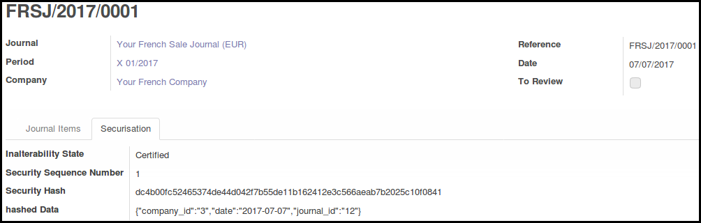

.. image:: https://img.shields.io/badge/licence-AGPL--3-blue.svg
   :target: http://www.gnu.org/licenses/agpl-3.0-standalone.html
   :alt: License: AGPL-3

================================
French Certification for Account
================================

This module extends the functionality of Account module to feat with
the french Sapin law. 

It generates a sequence for each french company, and a hash for each account
move, based on the hash of the previous account move, and the data of the move,
insuring inalterability of the account move, once validated.

It is not more possible to change datas for validated moves or to cancel them.

This 8.0 module is a backport and a refactor of l10n_fr_certification of
Odoo SA, made on Odoo 9.0 Community Edition.

Contrary to the functioning of the module of Odoo CE 9.0, the installation
of l10n_fr_certification_abstract doesn't block the installation of
'account_cancel', because it has no sense in a multi companies and multi
countries context. However, account move cancelling is insured by another
way.

To know more about hash generation and certification, please check the
description of the 'l10n_fr_certification_abstract' module.

Important Note
--------------

The hash generation is done with the same algorithm as the official 9.0 module
but for the time being, the official module has a trivial bug, that allow
user to change accounting datas without altering hash computation.

Do not use this module, before this bug is fixed, and the algorithm changes
are backported.

Ref: https://github.com/odoo/odoo/issues/17671

Usage
=====

.. image:: https://odoo-community.org/website/image/ir.attachment/5784_f2813bd/datas
   :alt: Try me on Runbot
   :target: https://runbot.odoo-community.org/runbot/121/8.0

Bug Tracker
===========

Bugs are tracked on `GitHub Issues
<https://github.com/OCA/pos/issues>`_. In case of trouble, please
check there if your issue has already been reported. If you spotted it first,
help us smash it by providing detailed and welcomed feedback.

Credits
=======

Images
------

* Odoo Community Association: `Icon <https://github.com/OCA/maintainer-tools/blob/master/template/module/static/description/icon.svg>`_.

Contributors
------------

* Sylvain LE GAL (https://twitter.com/legalsylvain)

Funders
-------

The development of this module has been financially supported by:

* Akrétion (http://www.akretion.com)
* GRAP, Groupement Régional Alimentaire de Proximité (http://www.grap.coop)

Maintainer
----------

.. image:: https://odoo-community.org/logo.png
   :alt: Odoo Community Association
   :target: https://odoo-community.org

This module is maintained by the OCA.

OCA, or the Odoo Community Association, is a nonprofit organization whose
mission is to support the collaborative development of Odoo features and
promote its widespread use.

To contribute to this module, please visit https://odoo-community.org.
