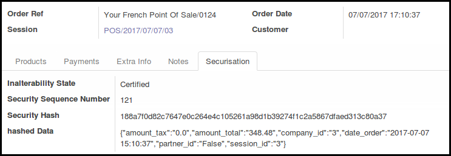
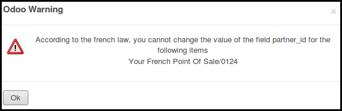
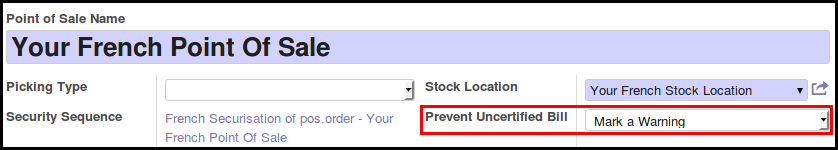
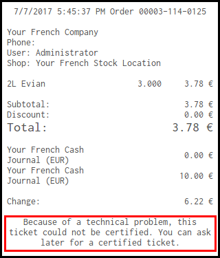

.. image:: https://img.shields.io/badge/licence-AGPL--3-blue.svg
   :target: http://www.gnu.org/licenses/agpl-3.0-standalone.html
   :alt: License: AGPL-3

======================================
French Certification for Point of Sale
======================================

This module extends the functionality of Point of Sale module to feat with
the french Sapin law.

It generates a sequence for each french pos config, and a hash for each pos
order, based on the hash of the previous pos order, and the data of the current
order, insuring inalterability of the orders, once paid.

It is not more possible to change datas for paid orders, for exemple,
changing the customer will be blocked.

To know more about hash generation and certification, please check the
description of the 'l10n_fr_certification_abstract' module.

Configuration
=============

To configure this module, you need to:

#. Set an extra key in openerp.cfg configuration file named 
   'l10n_fr_certification_mode' with the following value:

* 'legacy': Configuration is on each PoS config.
* 'warning': The bill will display the hash of the order on the bill
  or a warning, if the server is unreachable.
* 'block': The bill will not be printed, if the server is unreachable.

#. Go to 'Point Of Sale' / 'Configuration' / 'Point of Sale' and edit your
   french PoS Configs, setting the correct setting for the field
   'Prevent Uncertified Bill'. This field will be used only if the server is
   set to the mode 'legacy'.

Important note
--------------

'block' setting will break offline mode.

Usage
=====

Depending of the settings, the french bills printed by the point of sale :

* will display an extract of the hash of the order.

.. figure:: static/description/bill_with_hash.png

* will display a warning text, if setting is set to 'warning'.

* will not be printed, if setting is set to 'block'.

.. figure:: static/description/bill_unprinted.png

.. image:: https://odoo-community.org/website/image/ir.attachment/5784_f2813bd/datas
   :alt: Try me on Runbot
   :target: https://runbot.odoo-community.org/runbot/121/8.0

Bug Tracker
===========

Bugs are tracked on `GitHub Issues
<https://github.com/OCA/pos/issues>`_. In case of trouble, please
check there if your issue has already been reported. If you spotted it first,
help us smash it by providing detailed and welcomed feedback.

Credits
=======

Images
------

* Odoo Community Association: `Icon <https://github.com/OCA/maintainer-tools/blob/master/template/module/static/description/icon.svg>`_.

Contributors
------------

* Sylvain LE GAL (https://twitter.com/legalsylvain)

Funders
-------

The development of this module has been financially supported by:

* Akrétion (http://www.akretion.com)
* GRAP, Groupement Régional Alimentaire de Proximité (http://www.grap.coop)

Maintainer
----------

.. image:: https://odoo-community.org/logo.png
   :alt: Odoo Community Association
   :target: https://odoo-community.org

This module is maintained by the OCA.

OCA, or the Odoo Community Association, is a nonprofit organization whose
mission is to support the collaborative development of Odoo features and
promote its widespread use.

To contribute to this module, please visit https://odoo-community.org.
