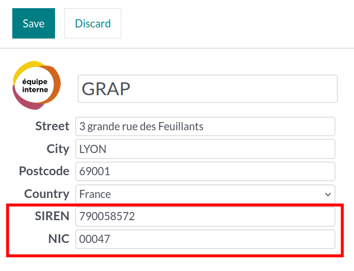
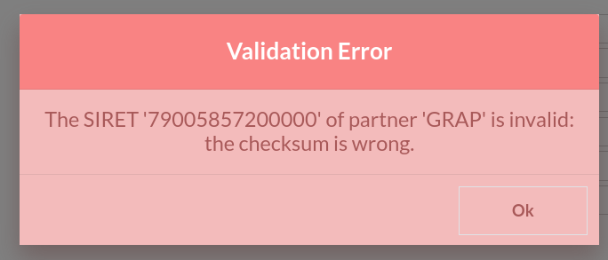

This module adds SIREN and NIC fields in PoS frontend during a customer creation.

If the data are incorrect, a warning is raised during the save process.
(The control is done in the OCA module ``l10n_fr_siret``.)

